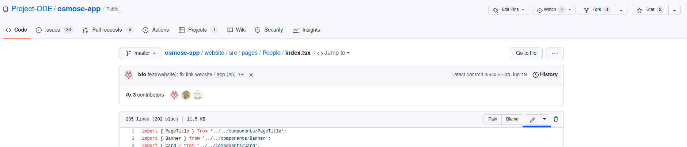
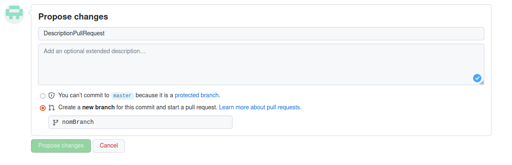
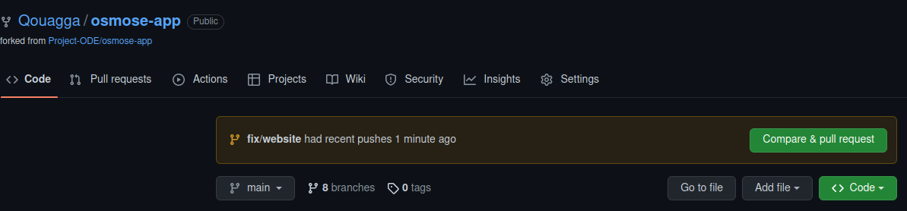

# Mise à jour de la page « People »

Si vous avez besoin de revoir [git](https://git-scm.com/book/en/v2/Getting-Started-Installing-Git).
Cet [aide mémoire](https://training.github.com/downloads/fr/github-git-cheat-sheet.pdf) peut vous aider de temps en temps.

Vous vous connectez à votre compte GitHub. Il doit apparaitre dans [cette liste](https://github.com/orgs/Project-ODE/teams/researchers/members). Vous pouvez commencer à travailler.
On peut arriver au même résultat via deux méthodes différentes :
* [En ligne via GitHub](#m%C3%A9thode-1-en-ligne-via-github)
* [En local](#m%C3%A9thode-2-en-local)

## Méthode 1 : en ligne via GitHub

il faudra aller sur le compte la page [osmose-app](https://github.com/Project-ODE/osmose-app).
Les fichiers concernant le site web sont tous regroupés dans le repertoire « website » (osmose-app>website).
Dans ce sous-ensemble, la page people se trouve dans le fichier [website/src/pages/People/index.tsx](../../website/src/pages/People/index.tsx) dans le répertoire People.

Pour pouvoir changer ce fichier il faudra l'éditer. Cliquer sur le crayon. . Vous pouvez faire les changements que vous souhaitez.

La description de chaque personne est représentée par un composant CardMember.
4 informations sont obligatoires  :
* name : le nom de la personne,
* img : l’image qui le représente ([2](#ajout-dune-image)),
* imgSide : la position de l’image (left or right),
* imgAlt : information qui sera affiché si l’image ne peut être affichée.

Les images devront se placer dans ce repertoire [website/src/img/people](../../website/src/img/people)
3 autres sont optionnels :
* Job : Son rôle au sein de l’équipe,
* Url : l’url de votre page personnel,
* urlDesc : la description de ce lien.

Ce composant CardMember englobera une balise paragraphe (`<p className="quote">Description<p>`).Au sein de cette balise, vous pouvez ajouter la description.
Par exemple, cela peut donner cela :
```
<CardMember
name="Dewi GLEAU"
img={dewiPortrait}
imgSide="right"
imgAlt=" Dewi portrait"
job="Tuto Creator"
>
    <p className="quote">
    I am a expert to create tutorial.
    </p>
</CardMember>
```

Une fois satisfait de vos ajouts. Vous pouvez les valider en créant une nouvelle branche et en la proposant à Osmose dans un nouveau pull request. Pour ça il suffit de remplir le formulaire qui est apparu en bas de la page web. 

## Méthode 2 : en local
Ensuite, il faudra cloner osmose-app vers votre repertoire local. Pour cela vous devez ajouter une [clé SHH](https://docs.github.com/en/authentication/connecting-to-github-with-ssh/adding-a-new-ssh-key-to-your-github-account).

Ensuite, vous allez pouvoir utiliser cette commande :
`git@github.com:Project-ODE/osmose-app.git`

Dans votre éditeur préféré, vous ouvrez le dossier contenant votre fork osmose-app.
Une nouvelle branche doit être créé avant de faire un changement. Il faudra aussi s’y déplacer.
`git checkout -b fix/nomDeVotreBranch`

Vous pouvez commencer à travailler. Les fichiers concernant le site web sont tous regroupés dans le repertoire « website » (osmose-app>website).
Dans ce sous-ensemble, la page people se trouve dans le fichier [website/src/pages/People/index.tsx](../../website/src/pages/People/index.tsx) dans le répertoire People.
La description de chaque personne est représentée par un composant CardMember.
4 informations sont obligatoires  :
* name : le nom de la personne,
* img : l’image qui le représente ([2](#ajout-dune-image)),
* imgSide : la position de l’image (left or right),
* imgAlt : information qui sera affiché si l’image ne peut être affichée.

Les images devront se placer dans ce repertoire [website/src/img/people](../../website/src/img/people)
3 autres sont optionnels :
* Job : Son rôle au sein de l’équipe,
* Url : l’url de votre page personnel,
* urlDesc : la description de ce lien.

Ce composant CardMember englobera une balise paragraphe (`<p className="quote">Description<p>`).Au sein de cette balise, vous pouvez ajouter la description.
Par exemple, cela peut donner cela :
```
<CardMember
name="Dewi GLEAU"
img={dewiPortrait}
imgSide="right"
imgAlt=" Dewi portrait"
job="Tuto Creator"
>
    <p className="quote">
    I am a expert to create tutorial.
    </p>
</CardMember>
```

Vérifiez l’état de git :
`git status`

Cette commande vous indiquera les fichiers inclus dans le prochain commit (en vert) et ceux non inclus (en rouge). Pour inclure un fichier (si vous faites une erreur [3](#annuler-un-add-malencontreux)):
`git add cheminDepuisRacineProjet`

Dans votre cas, ça sera donc :
`git add  website/src/pages/People/index.tsx`

A ce moment-là, partie « Changes to be committed » de git status doit contenir uniquement les fichiers qui vous intéresse.
Vous pouvez faire votre commit :
`git commit -am « le message de votre commit »`

Enfin vous pouvez les envoyer sur le compte Osmose-app via le remote que vous venez d'ajouter.
`git push –force-with-lease origin fix/nomDeVotreBranch`.

Sur GitHub, votre nouvelle branch va y apparaître. Un message sera également visible « nomBranch had recent pushes (time) ago ». Cliquer sur Compare&pull request.

Cela va vous donnez la possibilité d’ouvrir un pull request. Vous pouvez le valider en cliquant sur Create Pull Request. Il faudra attendre que ce pull request soit accepté par un développeur en charge d’osmose-app. Une fois fait, elle sera incluse dans le prochain déploiement Ifremer.


## Ajout d’une image
Pour ajouter une image il faudra l’importer via ce code. Dans le reste du fichier, vous pourrez utiliser l’image via son alias (dans l’exemple defautPortrait).
`import defautPortrait from 'chemin relatif vers l’image'`

## Annuler un add malencontreux
Pour cela une seule commande est nécessaire :
`git reset cheminDepuisRacineDuProjet`